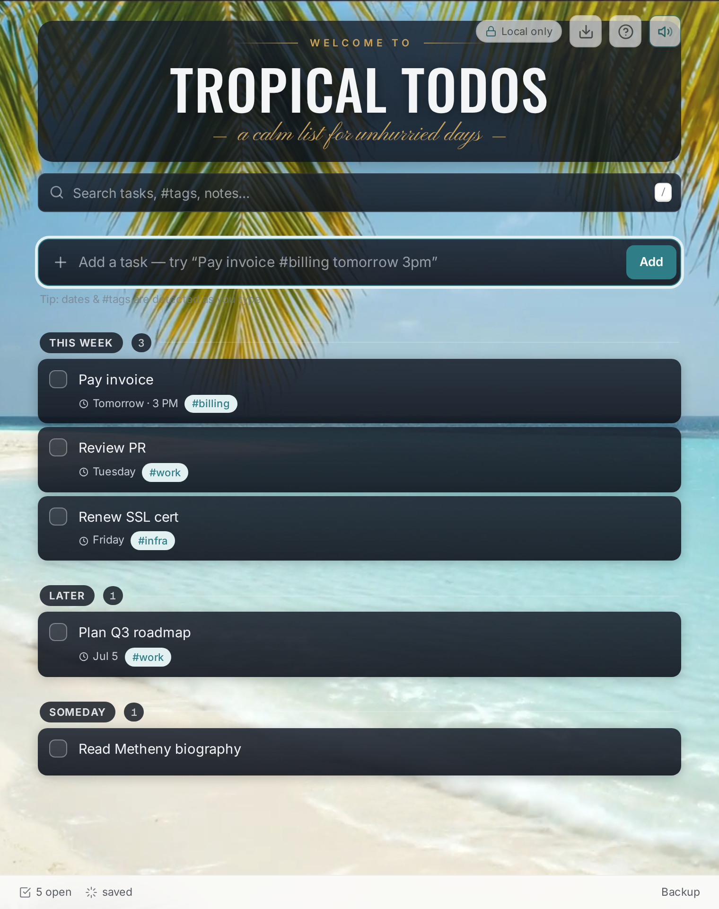

# 🌴 Tropical ToDos

### A calm, local-first to-do list with a cinematic beach backdrop and gentle ocean waves.

**▶ Live app: [stewalexander-com.github.io/tropical-todo-list](https://stewalexander-com.github.io/tropical-todo-list/)**

*Private by design · offline-first · zero network · installable PWA*

---

## What it is

A single-page to-do list that runs **entirely in your browser**. No account, no server, no network calls after the page loads — your tasks live only on your device. Behind the list plays a real, looping beach video with optional gentle wave sound and occasional real bird calls, framed by a vintage poster masthead.

## Features

- **Natural-language quick-add** — type `Pay invoice #billing tomorrow 3pm` and it parses the title, the `#billing` tag, and the due date/time automatically.
- **Calm date buckets** — Overdue · Today · This Week · Later · Someday.
- **Fuzzy search** over titles, `#tags`, and notes (`invce` finds "invoice").
- **Keyboard-first** — `/` search · `n` new · `j`/`k` move · `x` complete · `e` edit · `⌫` delete · `?` help.
- **Cinematic beach background** — an AI-rendered, seamlessly looping video (with a graceful still-image fallback). Tasks sit on dark "lava-rock" pills so text always reads.
- **Gentle ocean waves + birds** — a synthesized surf loop with occasional real bird calls layered in, on by default, with a one-tap mute toggle.
- **Backup, your way** — one-click JSON export, restore (merge or replace), and optional auto-backup to a folder you grant.
- **Offline-first PWA** — installable to your home screen with a tropical palm-and-sun icon; works with no connection.
- **Light & dusk themes** follow your system preference.

## Privacy

This is *private-by-no-network*. Data is stored in your browser's IndexedDB and never transmitted anywhere. The persistence layer is a single swappable module, so encrypted-at-rest storage can be added later without a rewrite.

## Install

Open the [live app](https://stewalexander-com.github.io/tropical-todo-list/) and use your browser's **Install** / **Add to Home Screen** option. It launches full-screen as **Tropical ToDos**.

## Run it yourself / deploy

Static files, zero build step. To host on GitHub Pages:

1. Copy the repo contents into a repository.
2. **Settings → Pages → Deploy from branch → `main` /(root)**.
3. Visit `https://<user>.github.io/<repo>/`.

## Project structure

| File | Purpose |
| --- | --- |
| `index.html` | App shell, styles, poster masthead |
| `app.js` | Store (IndexedDB), parser, bucketing, fuzzy search, keyboard, backup |
| `ambient.js` | Beach video (dual-crossfade loop) + wave audio + sound toggle |
| `sw.js` | Offline app-shell service worker |
| `manifest.webmanifest` | PWA install metadata |
| `assets/` | Beach video (day/dusk, desktop/mobile), posters, waves loop, `birds/` chirp clips |
| `icons/` | App icons, maskable variants, Open Graph share card |
| `_build/` | Asset generators (icon, caustics, waves) — not shipped to runtime |

## Credits

- **Beach video** — AI-generated with Veo from the owner's own beach photograph; day/dusk grades via ffmpeg. Seamless loop via a dual-video crossfade (pattern adapted from [rain-view](https://github.com/StewAlexander-com/rain-view)).
- **Wave audio** — procedurally synthesized (CC0). Audio unlock pattern adapted from [pocket-card](https://github.com/StewAlexander-com/pocket-card).
- **Bird calls** — short clips from real recordings on [Wikimedia Commons](https://commons.wikimedia.org/) (Common Tailorbird, Indian White-eye & Song Wren, CC BY-SA 4.0; Indian Golden Oriole, public domain), layered occasionally over the surf via the Web Audio API.
- Built by [StewAlexander.com](https://stewalexander.com).
